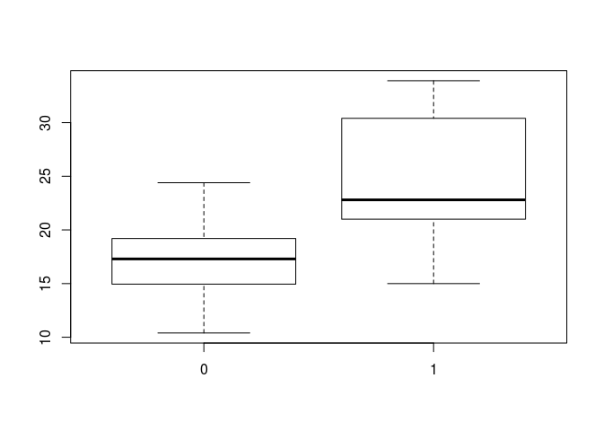
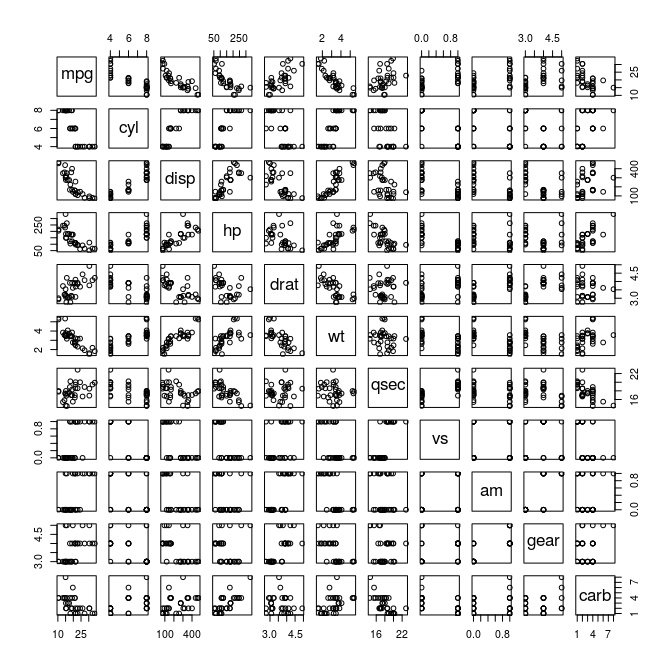
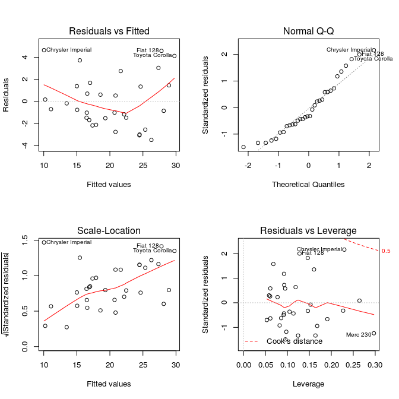

# Study about behaviour of transmission and other predictors of miles runs per gallon in Cars
Ismay Pérez Sánchez  
24/05/2015  


## Executive summary

This study has the purpose of determine the relationship between a set of variables and miles per gallon (MPG). The data used are the `mtcar` dataset available as a package of R, collected on previous studies some decades ago.  
The tasks that will be performed aims to solve the question of which kind of transmission is better for MPG and how different are they. The results indicate that Manual transmission is better than Automatic in about 3 mpg.  
For a more detailed document to reproduce this go to <https://github.com/mooc-only/regression_models>


## Exploratory data analyses

First, we will check how each kind of transmission affect independently to MPG. The `figure 1` (Appendix) constructed as a boxplot to show the distribution of MPG for each level of `am` variable (representing transmission), give us at first glace a very clear tendency of manual transmission to outperform automatic one. 
In `figure 2` are shown multiples plots in which can be selected **cyl**, **displ**, **hp**, **wt**, **vs**, **am** as the variables that visibly are correlated with MPG.

## Statistical Inference for corroboration of visual comparison of transmission type

Assuming normality in the MPG data by each kind of transmission we can make a T-test (`t.test(mpg ~ am, data=mtcars, alternative="greater", paired=F)` after leveling the manual type) with the following hypothesis:

$H_{0}$: MPG with manual transmission is less than with automatic.  
$H_{1}$: MPG with manual transmission is greater than with automatic.


Obtaining a p-value of 0.00069 with which we reject the null hypothesis and accept that manual transmission is better producing more  miles per gallon.

## Regression model

In order to quantify how different is the MPG between the transmissions we will create various models that fit as better as possible the behavior of the outcome, compare them with ANOVA criterion and perform some diagnostics on residuals.


The first candidate will be computed with the stepwise procedure (`step` function in R) using default parameter for direction 'both' (i.e: forward selection and backward elimination).
The resultant model is constructed as mpg ~ wt + qsec + am.  

For the other models, will be computed the correlations of all predictors with the outcome (MPG). Then, turn positive the negatives (because the magnitude is what it is important, the sign only shows the direction), sort them and calculate the differences between consecutive predictors. All the differences are under `0.1` (`10%` increase of correlation between closest predictors) what results in values somewhat spread between `0.005` and `0.09` (an additional analysis could be appropriate, but the space limits my will). The last values -more correlated predictors- concentrate the lowest differences, what makes the upper half of the list ( drat + hp + disp + cyl + wt) a clear separations to create an initial set for another model, but **am** is not between them, so it does not make sense for our purpose. Instead, we will create another models with all variables more correlated than **am**, including it, and a refined model with `step` function.


The new models are (mpg ~  am + vs + drat + hp + disp + cyl + wt) and the refined (mpg ~ hp + cyl + wt), this lack of interest because **am** are not in it. 
ANOVA test shows that reject $H_{0}$ for the 1st pair of models, thus, **wt** and **qsec** indeed improve the accuracy of the model over the basic (`mpg ~ am`). But fail to reject $H_{0}$ in the second, therefore, none of the models has significant difference over the other.


```
## Analysis of Variance Table
## 
## Model 1: mpg ~ am
## Model 2: mpg ~ wt + qsec + am
## Model 3: mpg ~ am + vs + drat + hp + disp + cyl + wt
##   Res.Df    RSS Df Sum of Sq       F    Pr(>F)    
## 1     30 720.90                                   
## 2     28 169.29  2    551.61 41.7217 1.543e-08 ***
## 3     24 158.65  4     10.63  0.4021    0.8052    
## ---
## Signif. codes:  0 '***' 0.001 '**' 0.01 '*' 0.05 '.' 0.1 ' ' 1
```

But the following analysis will be done with the model resultant from the initial stepwise algorithm because it has the higher sample correlation squared, meaning that it explains better the variability in the sample (check that the model discarded for not having **am** is included only to show that it cover less too).


```
##                                        formula RSquared
## 1                         mpg ~ wt + qsec + am  0.83356
## 2 mpg ~  am + vs + drat + hp + disp + cyl + wt  0.81801
## 3                          mpg ~ hp + cyl + wt  0.82634
```

## Residual plots and some diagnostics

In the `figure 3` there are many plots with the redisual analysis. Residual vs Fitted shows independence, Normal Q-Q indicate that the residuals are normally distributed and Scale-Location that variance is constant.
There are some points (3 in each plot) that are interesting to check. The 3 points with most leverage are found with the `hatvalues()` function.


```
##   Chrysler Imperial Lincoln Continental            Merc 230 
##           0.2296338           0.2642151           0.2970422
```

And those with most influence using `dfbetas()`.


```
##     Toyota Corona          Fiat 128 Chrysler Imperial 
##         0.4050410         0.4765680         0.5626418
```

Coincidentally are mostly the same points saw at the plots.

# Regression Model interpretation

Given the coefficients of the selected model: 

```
## (Intercept)          wt        qsec    amManual 
##    9.617781   -3.916504    1.225886    2.935837
```

Manual transmission improve Automatic transmission in almost 3 miles per gallon.  
The miles per gallon will increase by 1.2 for every qsec (1/4 mile time).  
For every ton increase in weight the cars will decrease approximately 4 miles per gallon.  

# Appendix

Figure 1

 

Figure 2

 

Figure 3

 
